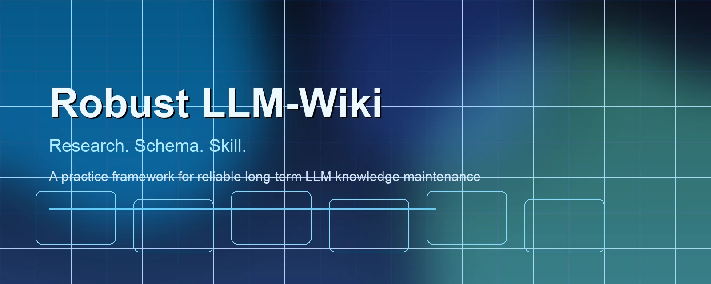
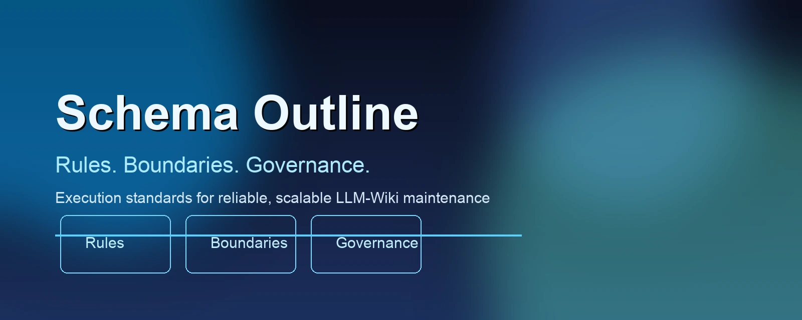

# Robust LLM-Wiki

[中文](./README.zh-CN.md) | **English**



Robust LLM-Wiki is an open-source practice framework.

It is not a new content Wiki repository. Instead, it turns frontline maintenance experience into reusable methods:

1. `Research` (evidence and problems)
2. `Schema` (red lines and execution rules)

## Why This Project Exists

This project was proposed after long-term maintenance of two real, production LLM-Wikis, where recurring issues appeared over time.

The two Wikis are anonymized as A/B and focus on:

1. life/relationship information and long-term ongoing items
2. AI/technical learning, research, and workflow accumulation

As of 2026-04-17, combined scale reached:

1. `3,093` Markdown files
2. `779,376` lines of Markdown text
3. `17,780` double-links (`[[...]]`)

At this scale, the hard part is not writing content. The hard part is maintaining it stably over time.

## Problems We Observed

1. Human-read and AI-read goals are mixed, so pages become either hard to read or hard to process.
2. Overuse of outline templates makes pages rigid and drifts away from the Wiki form.
3. Sources are often appended at the end, while body double-links are weak, and pages become isolated islands.
4. Rules and checks are not layered, so maintenance cost rises quickly with scale.

## Core Idea of Robust LLM-Wiki

Robust does not mean "more features." It means "more stable maintenance mechanisms."

1. Keep Karpathy's kernel unchanged: Wiki form, double-link network, and the ingest/query/lint loop.
2. Use `Schema` to define hard boundaries and safe extension space.
3. Keep workflow implementation decoupled from this repository at the current stage.

## Repository Structure



```text
.
|-- .github/
|-- CONTRIBUTING.md
|-- CONTRIBUTING.zh-CN.md
|-- I18N.md
|-- I18N.zh-CN.md
|-- README.md
|-- README.zh-CN.md
|-- research/
`-- schema/
```

### 1) Research

Purpose: preserve evidence, dataset scale, ecosystem observations, and problem summaries.

- Main doc: [research/RESEARCH.md](./research/RESEARCH.md)
- Survey snapshots: `research/snapshots/`
- Engineering notes (anonymized A/B): [research/2026-04-17-two-wikis-engineering-notes.md](./research/2026-04-17-two-wikis-engineering-notes.md)
- Ecosystem survey: [research/2026-04-17-llm-wiki-ecosystem-survey.md](./research/2026-04-17-llm-wiki-ecosystem-survey.md)

### 2) Schema

Purpose: define red lines, rules, extension boundaries, and open-source governance requirements.

- Main spec: [schema/SPEC.md](./schema/SPEC.md)
- Detailed rules: [schema/details/](./schema/details)
- New practice entry: [schema/details/07-turbo-model-value.md](./schema/details/07-turbo-model-value.md)
- Licensing/governance policy: [schema/OPEN_SOURCE_POLICY.md](./schema/OPEN_SOURCE_POLICY.md)

## Karpathy Kernel (Do Not Drift)

1. It must be a Wiki (knowledge is maintained as durable pages, not chat logs)
2. It must have double-links (navigable, discoverable, reusable)
3. It must keep the ingest/query/lint closed loop
4. It must remain traceable, auditable, and rollback-friendly

## Open-Source Licensing (Recommended)

1. Code and scripts: Apache-2.0
2. Research and standards docs: CC BY 4.0
3. Contribution process: DCO sign-off + third-party license declaration
4. Current repository license file: Apache-2.0 (`LICENSE`)

Detailed policy: [schema/OPEN_SOURCE_POLICY.md](./schema/OPEN_SOURCE_POLICY.md)

## Collaboration Docs

1. Contribution guide (EN): [CONTRIBUTING.md](./CONTRIBUTING.md)
2. Contribution guide (ZH): [CONTRIBUTING.zh-CN.md](./CONTRIBUTING.zh-CN.md)
3. Translation policy (EN): [I18N.md](./I18N.md)
4. Translation policy (ZH): [I18N.zh-CN.md](./I18N.zh-CN.md)

## Baseline Source

- Karpathy original gist: https://gist.github.com/karpathy/442a6bf555914893e9891c11519de94f
